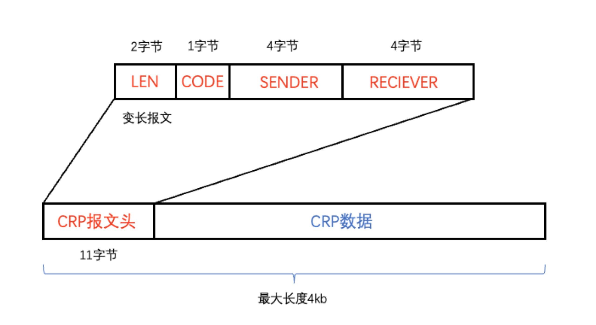
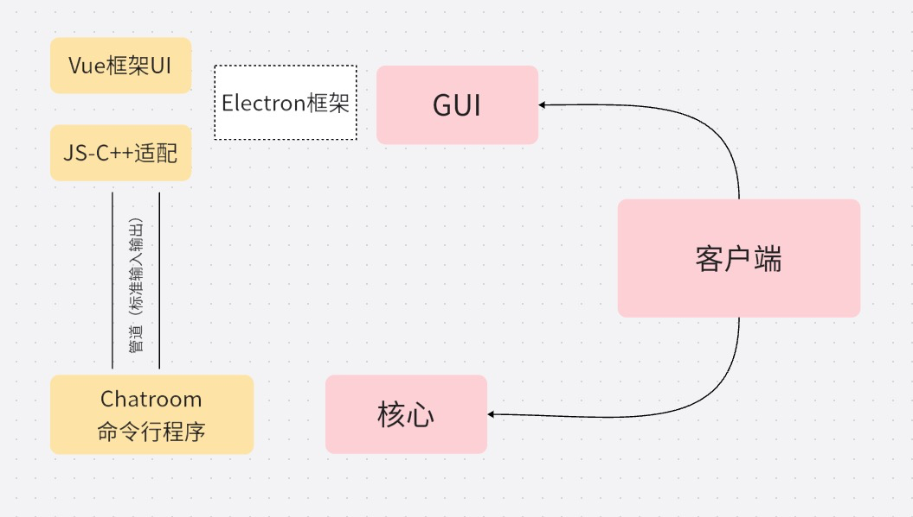
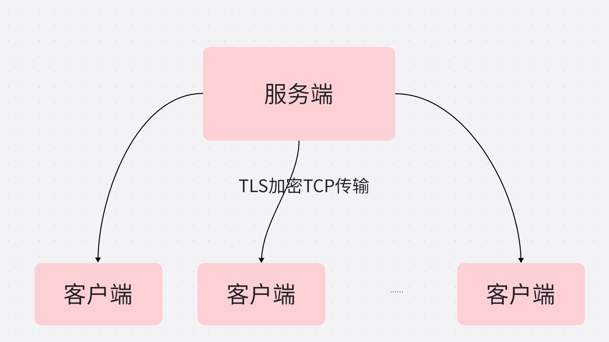
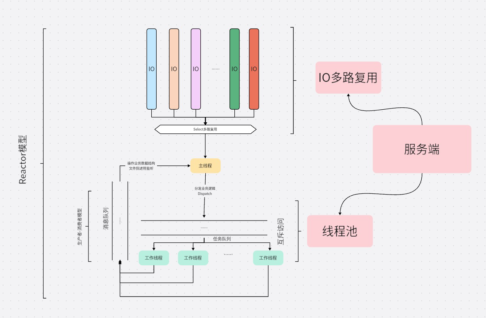

# ***\实 验 报 告\***

| 组号： | 1-1  |        |      |        |      |
| ------ | ---- | ------ | ---- | ------ | ---- |
| 姓名： |      | 学号： |      | 班级： |      |
| 姓名： |      | 学号： |      | 班级： |      |
|        |      |        |      |        |      |

## 实验名称

​	Socket 网络编程实验，实现一个简单的聊天程序

## 实验原理

使用 C++进行编写，采用了 C/S 模式。 

(1) 验证用户登录时，客户端发送用户输入的账户和密码，服务器端对账户的密码进行比较，若密码正确则服务器允许该客户进行登录。 

(2) 在发送文字消息时，用户指定发送报文类型为消息，封装到报文首部中，客户端向服务器端发送包含用户消息的报文，由服务器端将报文转到目标用户。 

(3) 发送文件时，用户指定发送报文类型为文件，封装到报文首部中，客户端向服务器端发送包含文件的多条报文，由服务器端将报文转到目标用户，然后进行合并。

## 实验目的

(1) 通过 socket 编程，进一步理解计算机网络的工作原理，掌握基本的socket 程序的编写方法，尝试设计和实现自己的应用层协议。 

(2) 掌握多线程编程的基本方法，理解多线程程序的工作原理和调试方法。

(3) 加深对c/s模式的理解。

## 实验内容

### 基本功能

#### 验证用户登录 

用户通过账户以及密码进行登录操作，若密码错误服务器不允许该用户登录。 

#### 用户之间的文字聊天 

用户之间可以进行文字聊天，且实时性较好，支持中英文。

#### 用户之间的文件传输

用户之间可以进行文件传输，文件传输准率高。

### 高级功能

1. 使用**IO多路复用**和**线程池**的Reactor架构，支持高并发多**1000+用户同时聊天和传输文件**。同时，服务端**跨平台**，使用select而不是epoll适用于Windows，Linux，MacOS。
2. TLS加密，使用OpenSSL库进行简单的包装就可以实现在TCP上的安全传输层。

### 实验实现

#### 人员分工

#### 协议设计

我们称这个应用层协议为`Chat Room Protocol`协议，即`CRP`协议。CRP基于TCP的可变长度应用层协议，专为在传输控制协议（TCP）传输层上传输可变长度的消息而设计。该协议允许应用程序通过在TCP段中封装应用层消息来可靠高效地在网络中交换数据。

##### 协议特点

1. 可变长度消息

   该协议支持可变长度的消息，每个消息的长度可以动态变化。这种灵活性使得应用程序能够发送不同大小的数据，而不受固定长度消息结构的限制。协议通过适当的消息分帧和分段机制确保每个消息的完整性。

2. 可靠传输

   该协议利用TCP作为底层传输机制，提供应用层消息的可靠传输。TCP保证按顺序传递、错误检测和丢失或损坏数据的重传。这确保应用层以正确的顺序接收消息，且没有数据丢失或损坏。

#####  报文格式

+ 报文头设计

  CRP协议专为聊天应用场景实现，报文头占11字节，其中包含字段：

  1. LEN：为支持变长报文的报文长度。我们**舍弃了定界符**，而采取了头中制定长度。
  2. CODE：标识报文的操作类型，放在前面方便服务器实现业务逻辑。
  3. SENDER和RECIEVER：字段以4字节标识发送者和接受者。

  

  
图1: CRP协议报文头部示意图

  报文最大长度为`4kb`，每个`CRP`报文能传输之多`4085b`的数据，若有子协议，则有效传输数据更少。

+ 操作码设计

  | 操作码     | DATA的含义                             | 功能               |
  | ---------- | -------------------------------------- | ------------------ |
  | CHAT       | 聊天文字<4096B                         | 用户单独聊天       |
  | CHAT_GROUP | 传输子协议数据                         | 进行群聊           |
  | FILE_START | 包含文件名和文件大小用于校验           | 进行文件传输开始   |
  | FILE_MID   | 文件内容非最后一个报文                 | 固定长度4096       |
  | FILE_END   | 最后一个文件块                         | 结束文件传输并校验 |
  | LOGIN      | 客户端传输密码，服务端响应登录成功与否 | 用户登录           |
  | LOGOUT     | 客户端为空，服务端响应登出成功与否     | 用户登出           |

表1: CRP协议操作码

​		操作详解：

   1. 文件中部

      为了保证**文件传输速率**，服务端在检查到“文件中间”操作码时**不进行长度校验**，收满4096字节直接转发。

   2. 群聊子协议

      

      
图2: 群聊子协议

​			群聊子协议将`CRP`数据段继续拆分。其中群聊子报文头中写入额外的接受者。每个接受者4字节，同时有**两字节**规定额外接受者数量，支持最大`65535+1`个群聊接受者。

#### UI设计

##### UI框架

##### 登录界面

##### 用户界面

#### 框架结构

##### 应用程报文以及socket封装

(1) CRPMessage类

表示聊天室中的消息，具有以下几个成员变量：

- length：消息长度，占用两个字节。

- op_code：操作代码，占用一个字节，表示消息的类型（登录、退出、聊天、文件传输等）。

- sender：发送者 ID，占用四个字节。

- receiver：接收者 ID，占用四个字节。

- data：消息内容，长度为 length-11。

成员函数包括：

- 默认构造函数，在对象创建时初始化成员变量为 0。

- 带参数的构造函数，用于设置成员变量的值。

- get_length、get_sender、get_receiver、get_data 和 get_op_code，用于获取相应的成员变量。

- unmarshal 和 marshal，用于将消息网络传输格式、内存格式相互装换

(2) CRP类

CRP 类表示一个用于网络通信的封装类。具有以下几个成员变量：

- fd：套接字文件描述符。

- recv_buf：接收缓冲区。

- send_buf：发送缓冲区。

- recv_pointer：接收缓冲区中未解析数据的长度。

- send_pointer：发送缓冲区中未发送数据的长度。

成员函数包括：

构造函数，用于初始化成员变量。

- receive，用于接收 CRPMessage。它首先调用 recv 函数从网络中接收数据，然后通过 unmarshal 方法将数据解析为 CRPMessage。接收到的消息可能不完整，因此需要在接收到足够多的字节之后才能解析消息。最后，将未解析的数据移动到缓冲区的开头。

- send，用于发送 CRPMessage。该方法将 CRPMessage 序列化到一个缓冲区，并通过 send 函数将数据发送到网络中。这个方法同样会保存未发送的数据，以便下一次发送使用。

- close，用于关闭套接字连接。

- get_fd 和 set_fd，用于获取和设置套接字文件描述符。

- get_send_pointer，用于获取发送缓冲区中未发送数据的长度。

(3) SocketStream类

SocketStream 类是TCP 套接字流的封装类，具有以下几个成员函数：

- 默认构造函数，创建一个套接字文件描述符，并初始化地址结构。

- close，用于关闭套接字连接。

- get_sock_fd，用于获取套接字文件描述符。

（4）SocketStreamHost 类

SocketStreamHost是TCP 服务器端的封装类，它继承自 SocketStream 类，并添加了以下成员函数：	

- 构造函数，初始化地址结构。

- host，将套接字与地址绑定并开始监听连接请求。

- accept，等待客户端连接并接受连接请求，返回一个新的套接字文件描述符。

（5）SocketStreamClient 类是TCP 客户端的封装类，也继承自 SocketStream 	类，并添加了以下成员函数：

- 构造函数，初始化地址结构。

- connect，连接服务器端并返回连接状态。

##### 客户端框架

(1) 。。。。

##### 服务端框架

(1) 。。。。

  

## 关键代码的描述

【主要代码源文件名及功能描述，是借鉴还是自主编写，自主编写需注明编写人。】

 

### 关键代码1……。

 

### 关键代码2……。

 

## 测试及结果分析

【测试过程应当比较详尽，把所有的功能都测试覆盖了，还要注意错误情况的处理。】

### 测试1

测试过程、说明、结果及分析。

 

### 测试2

测试过程、说明、结果及分析。

 

 

## 实验结论

 

## 总结及心得体会 

 

 

附件

1.源码文件

2.相关文档

3.参考资料（链接）……